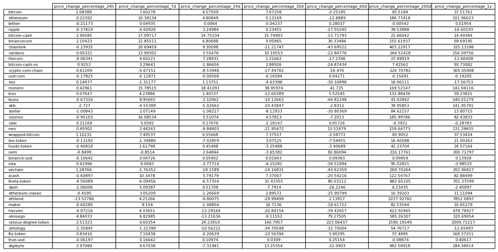
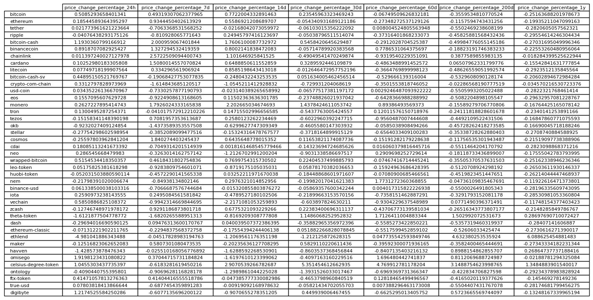

# CryptoClustering

This activity was conducted to predict if cryptocurrencies are affected by 24-hour or 7-day price changes using a knowledge of Python and unsupervised learning.

# Data Preparation

1. Normalized the data from the `crypto_market_data.csv` file using the `scikit-learn` [StandarScaler()] module.

2. Converted the scaled data into a DataFrame setting the index as the "coin-id" index from the original DataFrame.

# Determine the best k-value using the original scaled data DataFrame.
* Used the elbow method.

    i. Plotted the elbow curve using a dictionary that included the inertia for each value of k from 1 to 11. 

# Use K-means on the Original Scaled Data to Cluster Cryptocurrencies
* Used the best k-value to cluster the cryptocurrencies on the original scaled data.

    i. Initialized, fit, and pridicted the cluster groups of the cryptocurrencies with the K-means model.

    ii. Created a copy of the original DataFrame to include a column with the predicted clusters.

1. Used hvPlot to create a scatter plot with the x and y-axis set to "PC1" and "PC2", respectively with an added "coin_id" `hover_cols` parameter represented for each data point. 

# Optimize Clusters with Principal Component Analysis
* Perfomed a PCA on the original scaled DataFrame, reducing the features to three principal components. 

1. Determined how much information was attributed to each principal component by retrieving the explained variance. 

    i. Calculated the total explained variance of the three principal components. 

    ii. Converted the PCA data into a DataFrame setting the index as the "coin-id" index from the original DataFrame.

# Determine the best k-value using the PCA data DataFrame.
* Used the elbow method in the PCA data.

    i. Plotted the elbow curve using a dictionary that included the inertia for each value of k from 1 to 11. 

        a. Analyized the difference between this k value and the one found using the original data.

# Use K-means on the PCA Data to Cluster Cryptocurrencies
* Used the best k-value to cluster the cryptocurrencies on the PCA data.

    i. Initialized, fit, and pridicted the cluster groups of the cryptocurrencies with the K-means model.

    ii. Created a copy of the PCA data DataFrame to include a column with the predicted clusters.

1. Used hvPlot to create a scatter plot with the x and y-axis set to "price_change_percentage_24h" and "price_change_percentage_7d", respectively with an added "coin_id" `hover_cols` parameter represented for each data point.

    i. Discovered the impact of using K-means with fewer features to cluster the data. 

* Worked with tutor to create initial composite views and complete a cluster analysis.